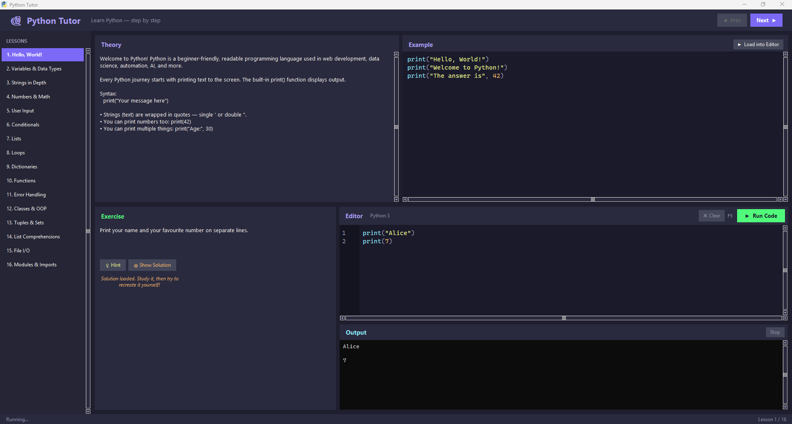

# 🎓 Python Tutor

**Python Tutor** is completely free software designed to help anyone learn Python from scratch — no prior experience required.

---

## What is it?

Python Tutor is a self-contained desktop application that teaches Python through **16 structured lessons**, each containing:

- **Theory** — A clear explanation of the concept
- **Example** — Working code you can study and run
- **Exercise** — A hands-on challenge to test your understanding
- **Hints & Solutions** — Help when you're stuck

The app includes a **real embedded terminal** (powered by PowerShell) so you can run your code and interact with it just like a professional developer would — including full support for `input()`.

---

## Download & Run

1. Download **PythonTutor.exe** from the [Releases](https://github.com/PlayDough1992/PythonTutor/releases) page
2. Double-click to run — no installation needed

> **Note:** The app itself runs without installing anything. However, to **execute your code** inside the app, Python 3 must be installed on your machine and available in your system PATH. This is because the built-in terminal runs your code through PowerShell, which calls Python directly.

> Python is free and available at [python.org](https://www.python.org/downloads/) — just make sure to tick **"Add Python to PATH"** during installation.

---

## Screenshot



---

## Lessons Covered

| # | Topic |
|---|-------|
| 1 | Hello World |
| 2 | Variables & Types |
| 3 | Strings |
| 4 | Numbers & Arithmetic |
| 5 | User Input |
| 6 | Conditionals |
| 7 | Lists |
| 8 | Loops |
| 9 | Dictionaries |
| 10 | Functions |
| 11 | Error Handling |
| 12 | Classes & OOP |
| 13 | Tuples & Sets |
| 14 | List Comprehensions |
| 15 | File I/O |
| 16 | Modules & Imports |

---

## Semi-Open Source & Contributing

This project is **semi-open source**. The source code is not publicly distributed, but the lesson curriculum is open for community contribution.

### How to contribute a lesson

1. Fork this repository
2. Open `lessons.py`
3. Add your lesson to the `LESSONS` list following the existing format:

```python
{
    "title": "Your Lesson Title",
    "theory": "Explain the concept here...",
    "example": 'print("Example code here")',
    "exercise": "Describe what the student should try to build.",
    "hint": "Point them in the right direction.",
    "solution": 'print("Solution code here")',
},
```

4. Submit a **Pull Request** with a brief description of what your lesson covers

If your lesson is approved, it will be included in the next build and the release will be updated.

---

## Icon

The app icon (`icon_preview.png`) is also open for improvement. If you create a better version, feel free to submit it via a Pull Request.

---

## License

Free to use, share, and learn from. Not for commercial redistribution.
